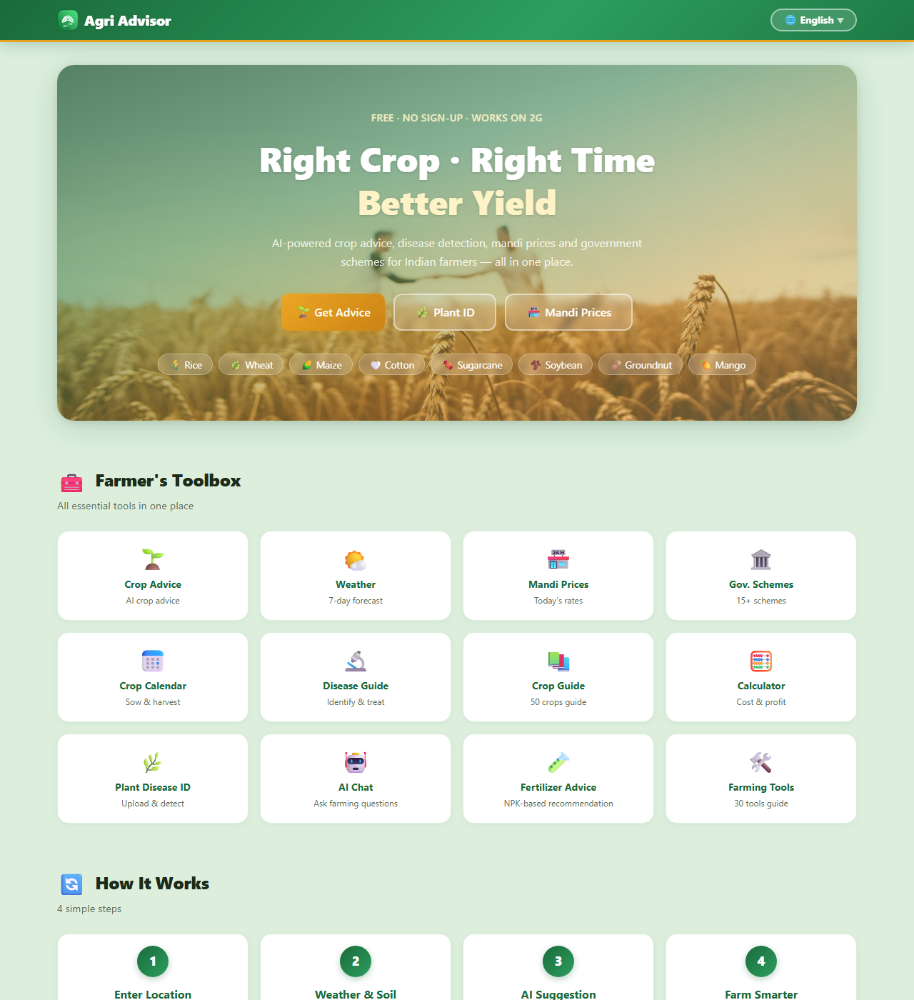

<div align="center">

# 🌾 Agri Advisor (Kisan Sathi)

**AI-powered farming assistant for Indian farmers**

[](https://agri-advisor-two.vercel.app)
[](mailto:rahulkumarindia200@gmail.com)




</div>

---

## 🔗 Quick Links

| | |
|---|---|
| 🌐 **Live Website** | https://agri-advisor-two.vercel.app |
| ℹ️ **About Page** | https://agri-advisor-two.vercel.app/about |
| 👨‍💻 **Developer** | Rahul Kumar — rahulkumarindia200@gmail.com |

> This project is developed and maintained by **Rahul Kumar only**.

## ✨ Features

- 🌱 **AI Crop Advice** — top 5 crops matched to your village's soil, season, rainfall & temperature (ML model, 2200 samples)
- 🔬 **Plant Disease ID** — upload a photo, Gemini Vision identifies the disease with symptoms, prevention & treatment
- 🧪 **Fertilizer Advisor** — soil-test NPK values → exact fertilizer grade, dosage & application schedule with warnings
- 🏪 **Mandi Prices** — 30+ commodities across all major states, with trends and live search
- 🌦️ **Weather** — village-level 7-day forecast with farming-specific tips (Open-Meteo)
- 📅 **Crop Calendar** — monthly sowing/growing/harvesting cycle for 64 crops
- 🏛️ **Government Schemes** — PM-KISAN, PMFBY, KCC & more with eligibility and apply steps
- 🧮 **Cost Calculator** — per-acre cost, revenue, profit & break-even price
- 🛠️ **Farming Tools** — guide to 30 tools with features and usage
- 🤖 **AI Chat** — voice input/output, image upload, works offline with demo answers
- 🗣️ **5 Languages** — English, हिन्दी, मराठी, தமிழ், తెలుగు
- 📱 **Mobile-first** — fast on 2G, no sign-up, completely free

## 🚀 Getting Started

```bash
git clone https://github.com/oyerahulz/Agri_Advisor.git
cd Agri_Advisor/kiro_project/kisan-sathi
npm install

# create .env.local
echo "NEXT_PUBLIC_GEMINI_KEY=your_gemini_api_key" > .env.local

npm run dev
```

Open http://localhost:3000 — get a free Gemini key at [Google AI Studio](https://aistudio.google.com/apikey).

> The app works without a key too (demo mode) — AI chat & disease ID give helpful offline answers.

## 🛠️ Tech Stack

- **Next.js 16** (App Router, Turbopack) · **React 19** · **TypeScript**
- **Tailwind CSS 4** · **Google Gemini AI** (chat + vision) · **Open-Meteo API**
- ML crop recommendation model · Deployed on **Vercel**

## 📄 License & Author

**Rahul Kumar** · [rahulkumarindia200@gmail.com](mailto:rahulkumarindia200@gmail.com) · [GitHub](https://github.com/oyerahulz)

© 2026 Agri Advisor · For farmers, by farmers 🌱
